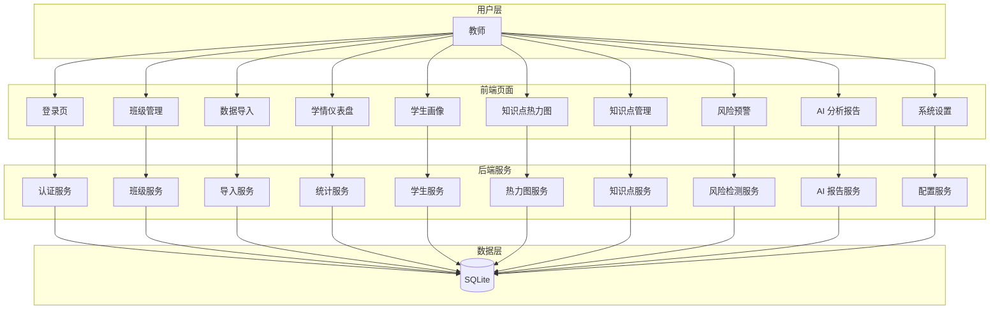
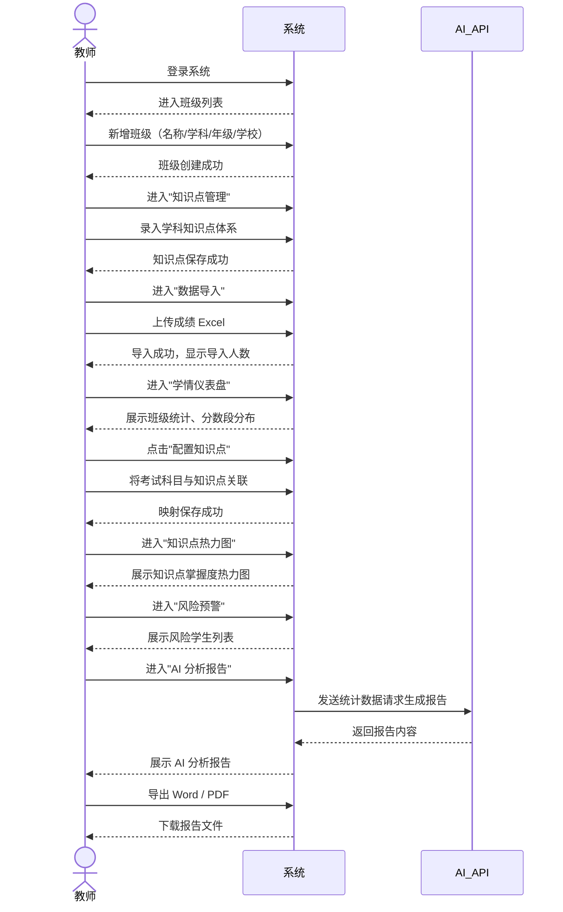
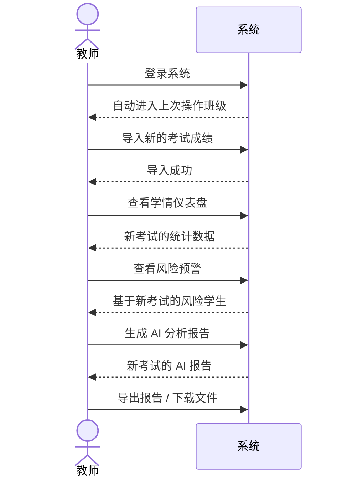
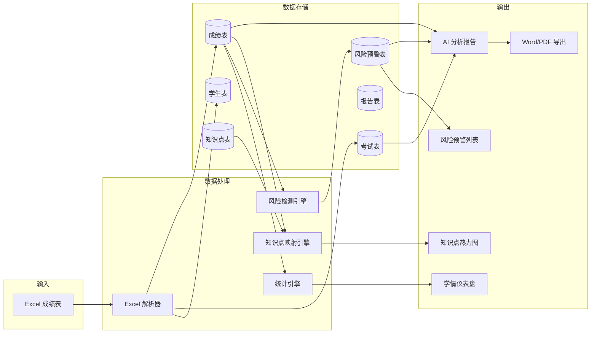

# 学情智能分析与预警系统 — 功能全景图

> 本文档是系统的功能总览与数据流说明，面向开发者、设计师和教师用户。
> 边做边沉淀，新功能上线后须同步更新此文档。

---

## 一、功能总览

| 模块 | 功能点 | 说明 |
|------|--------|------|
| **认证** | 登录 | 内置教师账号登录，JWT Token 鉴权 |
| | 退出登录 | 清除 Token 和当前班级上下文 |
| **班级管理** | 班级列表 | 查看所有班级、实时学生人数 |
| | 新增班级 | 录入班级名称、学科、年级、学校 |
| | 编辑班级 | 修改班级信息 |
| | 删除班级 | 删除班级及关联数据 |
| | 进入班级 | 设置当前操作班级，后续功能自动带入班级上下文 |
| **数据导入** | 上传 Excel | 按固定模板上传成绩表 |
| | 自动解析 | 识别学生、考号、总分、各科得分 |
| | 数据落库 | 自动创建/更新学生、创建考试、录入成绩 |
| **学情仪表盘** | 考试切换 | 选择不同考试查看统计 |
| | 班级统计 | 均分、标准差、及格率、优秀率 |
| | 分数段分布 | 柱状图展示各分数段人数 |
| | 成绩明细 | 学生成绩列表（姓名、考号、总分、班名次） |
| | 配置知识点映射 | 将考试科目与知识点管理中的知识点关联 |
| | 生成 AI 报告 | 跳转至 AI 分析报告页面 |
| **学生画像** | 学生列表 | 查看班级所有学生 |
| | 个人详情 | 学生历次考试成绩趋势、各科得分 |
| **知识点热力图** | 考试选择 | 选择考试查看对应热力图 |
| | 热力图展示 | 学生 × 知识点的掌握度矩阵（颜色深浅表示得分率） |
| **知识点管理** | 知识点列表 | 按班级查看已配置的知识点树 |
| | 新增/编辑/删除 | 维护知识点体系（支持层级） |
| | 考试映射配置 | 在学情仪表盘中配置考试与知识点的关联 |
| **风险预警** | 风险学生列表 | 自动标记高风险、中风险、低风险学生 |
| | 风险详情 | 展示风险类型、原因、改进建议 |
| **AI 分析报告** | 自动报告生成 | 基于统计数据 + 风险数据调用 AI 生成分析报告 |
| | 报告查看 | Markdown 格式渲染展示 |
| | 报告导出 | 导出为 Word / PDF |
| **系统设置** | AI 模型配置 | 选择服务商、配置 API Key、Base URL、模型 |
| | 测试连接 | 一键验证 API 配置是否可用 |

---

## 二、功能模块划分图



---

## 三、核心用户操作流程

### 3.1 教师首次使用流程



### 3.2 日常分析流程（已有班级和数据）



---

## 四、数据流转图

### 4.1 数据实体关系

```mermaid
erDiagram
    User ||--o{ Class : manages
    Class ||--o{ Student : contains
    Class ||--o{ Exam : has
    Class ||--o{ KnowledgePoint : defines
    Student ||--o{ Score : has
    Exam ||--o{ Score : contains
    Exam ||--o{ ExamKnowledgeMapping : maps_to
    KnowledgePoint ||--o{ ExamKnowledgeMapping : mapped_by
    Student ||--o{ RiskAlert : has
    Exam ||--o{ RiskAlert : generates
    Exam ||--o{ Report : generates
    Class ||--o{ Report : owns
    Student ||--o{ StudentKnowledgeScore : has
```

### 4.2 核心数据流



---

## 五、页面路由与功能对照

| 路由 | 页面 | 核心功能 |
|------|------|----------|
| `/login` | 登录页 | 账号密码登录 |
| `/classes` | 班级管理 | 增删改查班级，进入班级 |
| `/import/:classId` | 数据导入 | 上传 Excel，解析成绩 |
| `/dashboard/:classId` | 学情仪表盘 | 统计图表、成绩明细、配置知识点映射、生成报告 |
| `/students/:classId` | 学生画像 | 学生列表、个人成绩趋势 |
| `/heatmap/:classId` | 知识点热力图 | 掌握度矩阵可视化 |
| `/knowledge-points/:classId` | 知识点管理 | 知识点 CRUD |
| `/risk/:classId` | 风险预警 | 风险学生列表与详情 |
| `/report/:classId/:examId` | AI 分析报告 | 报告查看与导出 |
| `/settings` | 系统设置 | AI 模型配置与测试 |

---

## 六、全局状态说明

| 状态项 | 存储位置 | 用途 |
|--------|----------|------|
| `token` | localStorage | JWT 鉴权 |
| `currentClassId` | localStorage | 当前操作班级 ID，菜单跳转时自动附加 |
| `currentClassName` | localStorage | 当前班级名称，用于面包屑和 Header 展示 |

---

## 七、待完善的功能断点

| 断点 | 现状 | 目标 |
|------|------|------|
| 知识点管理 ↔ 热力图 | 有映射配置入口，但配置后热力图展示效果待优化 | 映射后热力图精准展示各知识点掌握度 |
| 数据导入后引导 | 导入成功只显示 toast，没有下一步引导 | 导入后提示用户去仪表盘/热力图查看分析 |
| 空状态处理 | 多个页面无数据时只有文字提示 | 增加空状态插画和操作引导 |
| 表单校验反馈 | 部分表单错误提示不醒目 | 统一表单校验与错误反馈样式 |

---

*最后更新：2026-05-22*
